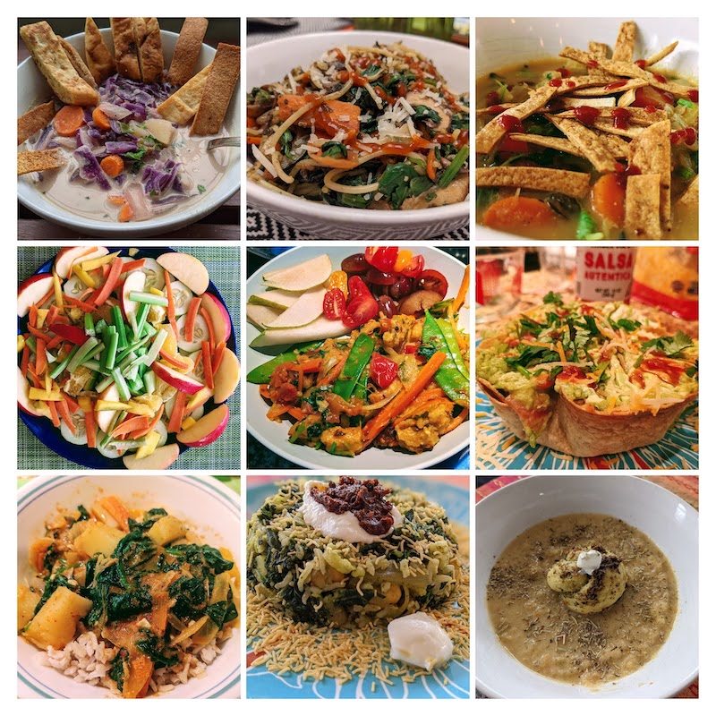

# My Offline Cookbook!!

---

👩🏽‍🍳 | Welcome to _My Offline Cookbook_!

This is project that serves as both a sandbox for me to explore modern web development techniques and practices - and a functional website to help me consolidate and organize the many recipes I've published under the [#Recipes4AJ](https://twitter.com/search?q=%23Recipes4AJ&src=typed_query&f=livey) and [#RecipesForAJ](https://twitter.com/search?q=%23RecipesForAJ&src=typed_query&f=live) tags on Twitter.

---

## Origin Story

"Recipes For AJ" was a hashtag I started on Twitter as a breadcrumb trail for my now-13yo to revisit later in life. I am an American of South Asian (Indian) descent and a lifelong vegetarian who loves to cook. And I wanted to make sure I left him not just memories of the various meals we've had as a family, but tools to help him recreate those meaningfully in his own life. 

I am one of those _cook-by-instinct_ folks who rarely follows strict recipe measurements and guidelines, and instead follows my sensory guidance (taste, appearance, aroma) with a dash of whimsy. With this recipe site, I wanted to make that a little more actionable for him by adding some indications of measurements and steps to follow. All the while devoutly hoping he brings his own vision and style to make them his own.

---

## Under The Hood

I was motivated to start this as a means of experimenting with modern web technologies in a real-world sandbox. I was looking for a demo app to use for a ["Developing Progressive Web Apps (PWA)"](https://dev.to/azure/07-developing-progressive-web-apps-hfb) article. And I found this amazing [starter template](https://github.com/maeligg/my-online-cookbook) for _My Online Cookbook_.
 * It is optimized for recipes, search and extensibility.
 * It uses [https://11ty.io/](Eleventy), a static site generator
 * It uses [https://www.netlifycms.org/](NetlifyCMS) for content management.
 * It was setup to [deploy to Netlify](https://myonlinecookbook.netlify.app/) as its hosting provider.

You can read the [original README](README.original.md) for more details on the template and setup. I've wanted to play with Eleventy, so this was added incentive. But I had other requirements:
 * I wanted to use a different hosting provider and CMS (e.g., on Azure)
 * I wanted to make this _My Offline Cookbook_ (i.e., become a PWA)
 * I wanted to explore advanced capabilities (AI, PWA, Serverless)

You can look at my [initial SETUP notes](under-the-hood/SETUP.md) and keep an eye out for more updates as I explore these modifications.

---

## Releases

You can find [releases](https://github.com/fearlessly-dev/recipe-me/releases) of the source code corresponding to various milestone moments in development. Comments and Issues feedback are always welcome.

| Release | Date | Comments |
|:--- |:---|:---|
| [v0.1-basic-pwa](https://github.com/fearlessly-dev/recipe-me/releases/tag/v0.1-basic-pwa)| Feb 22, 2022 | Corresponds to setup documented in the ["Developing Progressive Web Apps (PWA)"](https://dev.to/azure/07-developing-progressive-web-apps-hfb) article. Adds basic PWA capability to make the online cookbook work offline! |
| | | |
| | | |
