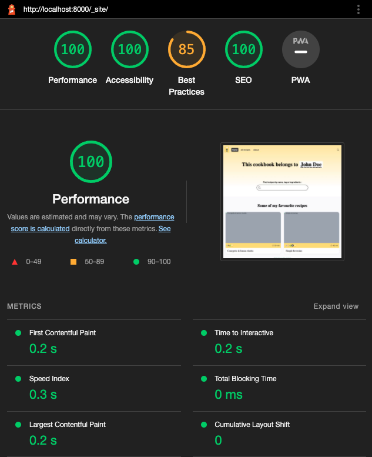
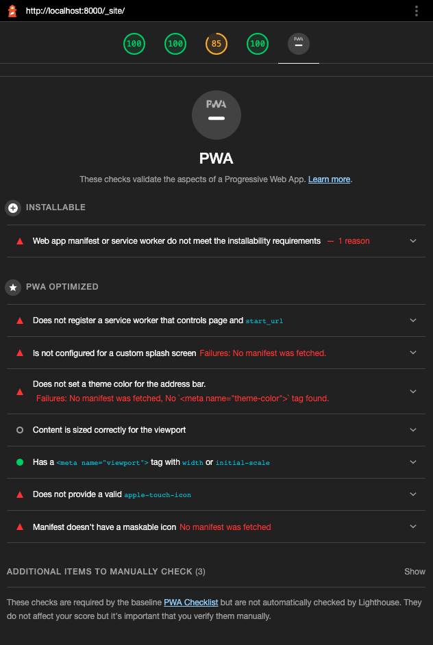
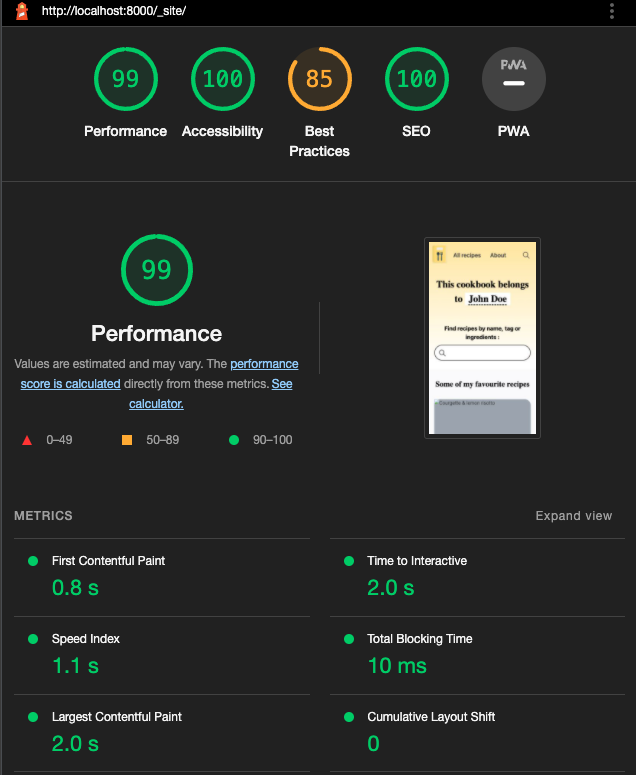
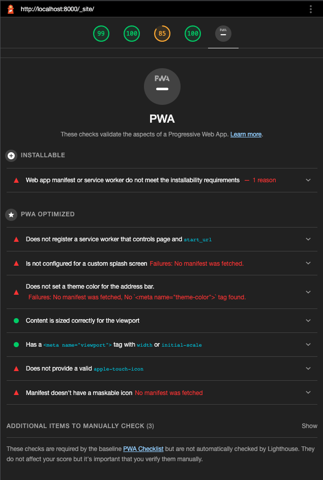
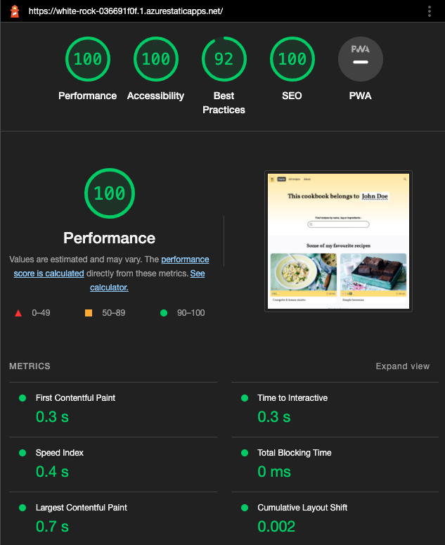
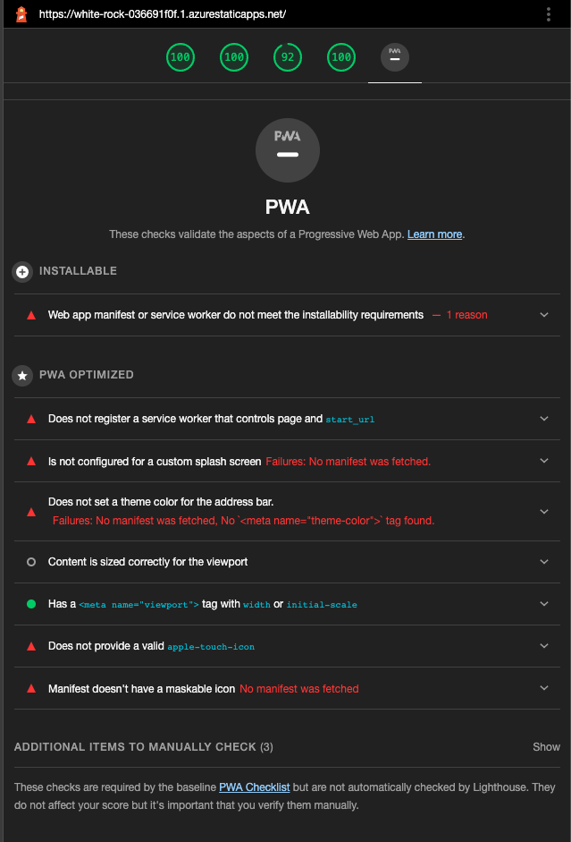
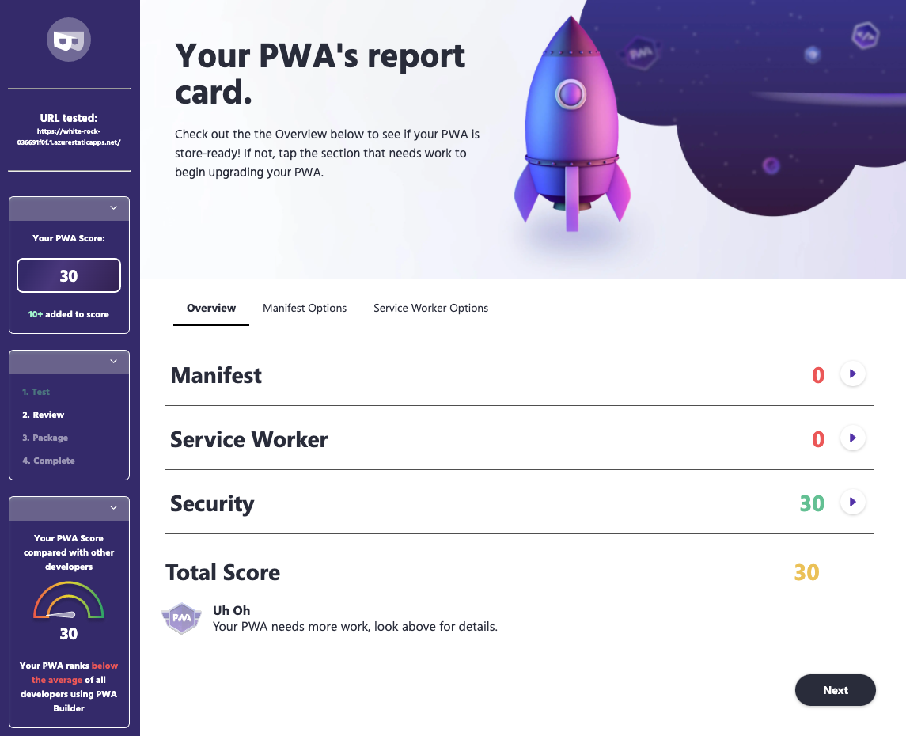
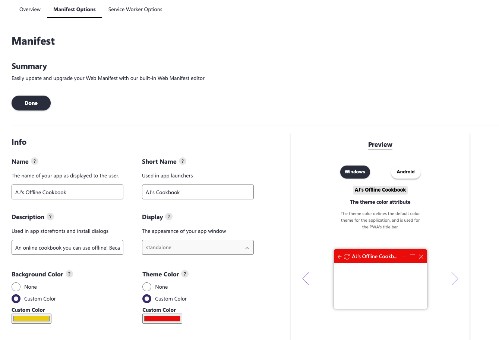
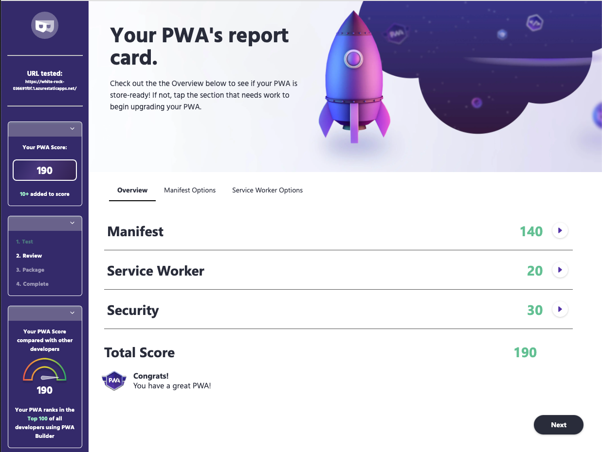
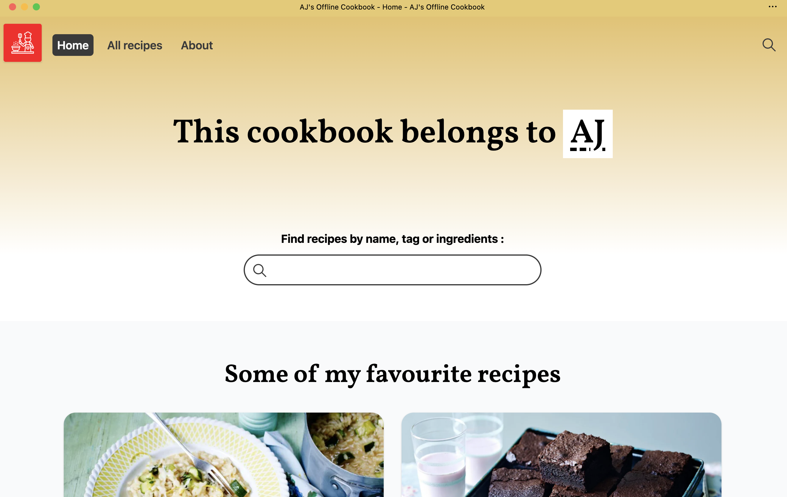

# Setup
Documenting my process for using this 11ty starter project to build a custom recipe site. [Eleventy needs Node.js v12 or higher.](https://www.11ty.dev/docs/getting-started/). Here is what I am using in development:

```
$ node -v  
v16.2.0
```
---

## 1. Get app running locally 

Use template to create instance. Build and preview default site.

```
$ npm install
$ npm run dev
```

Build for production. Preview build version locally.

```
npm run build
cd ./_site
python -m http.server       
Serving HTTP on :: port 8000 (http://[::]:8000/) ...
```

---

## 2. Inspect app in browser DevTools

By default, apps must be served from an HTTPS-enabled endpoint in order for Progressive Web App capabilities to be accessed. However browsers like [Microsoft Edge](https://docs.microsoft.com/en-us/microsoft-edge/progressive-web-apps-chromium/how-to/) will allow access from _http://localhost_ endpoints for debugging purposes only.

Let's check this out by opening browser DevTools. On my Microsoft Edge browser, I see two options of interest:
 * Applications tab - explore PWA components and status
 * Lighthouse tab - audit app for performance and PWA

When we open the Applications tab, we can see panels for _Manifest_, _Service Workers_ and _Storage_, but nothing much to see here since this app is not yet PWA enabled.

Let's fire up a Lighthouse audit to get some baseline guidance for improvements. I ran audits for both mobile and desktop options - and captured screenshots for both base performance and PWA readiness. Here's what that looks like:

| Desktop Perf | Desktop PWA |
|:---|:---|
| | |
| Mobile Perf | Mobile PWA |
| |  |

We can look at improving performance aspects later - but for now let's focus on PWA. We can immediately see the two main issues:

 * _Installable_: No manifest was found.
 * _PWA Optimized_: Does not register a service worker.

The audit also recommends a manual check against the [PWA Checklist](https://web.dev/pwa-checklist/). Let's keep that in mind for later.

---

## 3. Deploy app to HTTPS-enabled endpoint

Let's deploy what we currently have to an HTTPS-enabled server. Most hosting providers will do this for you by default - I chose to deploy my app to [Azure Static Web Apps](https://white-rock-036691f0f.1.azurestaticapps.net/). The process was quick and painless using the [Azure Static Web Apps Extension](https://marketplace.visualstudio.com/items?itemName=ms-azuretools.vscode-azurestaticwebapps) for VS Code.

 - Log into Azure (via VS Code)
 - Install extension. You see a Static Web Apps pane in Azure.
 - Navigate to it, select an Azure subscription to use.
 - Click `+` to start workflow to add this project to SWA
 - Authorize access to your GitHub repo.
 - Select `Other` for custom configuration
 - Specify `/` for app source, `_site` for build folder
 - Confirm, wait, check the Azure Portal. _App is running!_

The Static Web Apps helper uses the default _build_ script in your _package.json_ and adds the required _GitHub Actions workflow_ to your repository so the app is rebuilt and deployed automatically on every commit.

We have a running PWA in the cloud! You can use the DevTools to run an audit on the deployed version as well. For completeness, I ran it for just desktop mode and captured the performance and PWA scores.

| Performance | PWA  |
|:--- |:--- |
| ||

This seems to have fixed some of the performance best practices issues - but we still have to fix the PWA. Let's focus on that next!

---

## 4. Making Your App a PWA

We know we have to add a manifest, and configure the service worker. And we can do this manually by:
 * Creating a `manifest.json` file with relevant members and adding the relevant `<link>` in app HTML to show its location.
 * Creating a `sw.js` file for service worker implementation and populating it with the relevant lifecycle and functional event handlers for operation, and placing it in the right location of app structure to suit its scope.
 * Registering the service worker in the app code.

But we can also take advantage of helpful PWA tools that make this easier for us. 

For example, for service workers: [Workbox](https://developers.google.com/web/tools/workbox) is a popular set of libraries that can help you create production-ready service workers for your PWA. And the eleventy static site generator I am using provides an [eleventy-plugin-pwa](https://www.npmjs.com/package/eleventy-plugin-pwa) that uses it to generate the service worker, with guidance on how to update the source code to register it and add a Web App Manifest.

We'll look at Workbox and other tools in our upcoming "Developer Tools" week. For now, I wanted to try something a little different.

---

## 5. Getting an assist from PWABuilder

I'm trying out [PWABuilder](https://www.pwabuilder.com/) - a free auditing tool that evaluates your PWA, providing an audit report with actionable options to help you fix identified issues. Just enter your hosted app URL and click Start.

Here's what my audit report looks like. _Sad Trombone_ - we only scored a 30!



 * The good news? That comes from satisfying the _Security_ requirement by using HTTPS, having a valid SSL certificate, and no mixed content on page. 

 * More good news? The _Manifest Options_ and _Service Worker Options_ tabs can help us generate the required _manifest.json_ and _sw.js_ files we need to satisfy installability and network-independent operations for PWA.

Let's go!

--- 

## 5. Configuring Manifest Options

Let's dive into the Manifest Options tab. Here is what that looks like as I start modifying things.



Some things that make this useful:
 * It pre-populates some fields, making it easier to do small edits.
 * It provides previews showing how manifest options impacts your app on desktop and mobile.
 * It has helpers to generate icons and screenshots!

You can generate and save the file to `manifest.json` for use in your PWA. You can also just generate this with any text editor - just make sure it is valid JSON. I saved the file and manually cleaned it up a little:
 * updating icon paths to reflect project structure
 * picking some [categories](https://developer.mozilla.org/en-US/docs/Web/Manifest/categories) for my app domain

The icons and manifest were saved into the `src/` and `src/assets` folder of my PWA and the _eleventy.js_ config file updated to show that these should be "passed through" to the build as is. Here is what my manifest.json looks like.

 ```json
 {
    "lang": "en-us",
    "name": "AJ's Offline Cookbook",
    "short_name": "AJ's Cookbook",
    "description": "An offline-friendly online cookbook perfect for that campfire trip off-the-grid",
    "start_url": "/",
    "background_color": "#ff001b",
    "theme_color": "#e8ca6c",
    "orientation": "any",
    "display": "standalone",
    "scope": "/",
    "dir": "ltr",
    "icons": [
        {
            "src": "/assets/logo192.png",
            "sizes": "192x192",
            "type": "image/png"
        },
        {
            "src": "/assets/logo512.png",
            "sizes": "512x512",
            "type": "image/png"
        }
    ],
    "categories": [
        "food",
        "health",
        "book",
        "entertainment"
    ],
    "screenshots": [],
    "shortcuts": []
}
 ```

Now, we need to update the app HTML to show where the manifest.json is located. In my 11ty project, I update this in the `src/layouts/base.njk`  template. The end result is a `<link>` in your app _index.html_ that looks like this.

 ```html
<link rel="manifest" href="/manifest.json">
 ```

If you inspect a site preview (localhost) or deployed (build) version now, you should see the Manifest section of the Applications tab reflect the properties you just added. Let's commit the changes and go to the next fix.

---

## 6. Add the Service Worker

As before, you can do this manually or jumpstart the process using PWABuilder. We need to do two things:
 * Create the service worker implementation.
 * Register the service worker to initialize on startup 

[This guide](https://docs.microsoft.com/en-us/microsoft-edge/progressive-web-apps-chromium/how-to/#step-3---add-a-service-worker) explains how we can do this with PWABuilder. Let's try it out.

I generated the service worker for the `cache-first` strategy. The download gave me two files. 

First the _pwabuilder-sw-register.js_ file which does the registration for you. The contents are below.

```js
// This is the "serving cached media" service worker

// Add this below content to your HTML page inside a <script type="module"></script> tag, or add the js file to your page at the very top to register service worker
// If you get an error about not being able to import, double check that you have type="module" on your <script /> tag

/*
 This code uses the pwa-update web component https://github.com/pwa-builder/pwa-update to register your service worker,
 tell the user when there is an update available and let the user know when your PWA is ready to use offline.
*/

import 'https://cdn.jsdelivr.net/npm/@pwabuilder/pwaupdate';

const el = document.createElement('pwa-update');
document.body.appendChild(el);
```

I saved this to `src/pwbuilder-sw-register.js` in my project repo, then added this to my `src/layouts/base.njk` file inside the `<head>` tag. 

Next, the _pwabuilder-sw.js_ implementation file.

```js
// This is the service worker with the Cache-first network

const CACHE = "pwabuilder-precache";

importScripts('https://storage.googleapis.com/workbox-cdn/releases/5.1.2/workbox-sw.js');

self.addEventListener("message", (event) => {
  if (event.data && event.data.type === "SKIP_WAITING") {
    self.skipWaiting();
  }
});

workbox.routing.registerRoute(
  new RegExp('/*'),
  new workbox.strategies.CacheFirst({
    cacheName: CACHE
  })
);
```


Lastly, I updated the `eleventy.js` configuration to make sure both files were passed through to build.

Let's do a quick inspection in DevTools. Would you look at that? We have a service worker!!  Time to commit the changes and push them to deployed app.

---

## 7. The Final Test & Audit!

Let's run that final PWA Builder Audit - we did it!! We have an installable PWA with a viable offline experience, ready to start building up from!!

| Where It Started | Where It's Going |
|:---|:---|
|  |  |

It's a perfect time to test it.
 * Install the PWA on your local desktop. This is what mine looks like when installed on a MacBook Pro. Notice the standalone mode (no browser address bar or other hints that this is a web app)
 * Explore your PWA - does it work and feel like a native app?
 * Disconnect from the network (e.g., put your laptop in Flight mode). Can you still launch and explore it?
 * Use the search tool (Finder on Mac) - can you discover your PWA just like any other natively installed app?



Now if you'll excuse me - I have a campfire trip to plan off the grid for the long weekend! 

---

## 8. Exercise

Your turn!! Take an existing app and try to refactor it to be a basic PWA.
 * Inspect it locally - check your Application and Lighthouse tabs
 * Audit it on PWABuilder - get baseline scores and guidance
 * Host it on HTTPS-enabled server - GitHub pages or Azure Static Web Apps can help
 * Add a Manifest - and link it.
 * Test it - can you install this to desktop?
 * Add a Service Worker - and register it.
 * Inspect it once in DevTools locally - then deploy it
 * Test it - go Offline. Does the app still work?
 * Audit it - how has the score changed?


